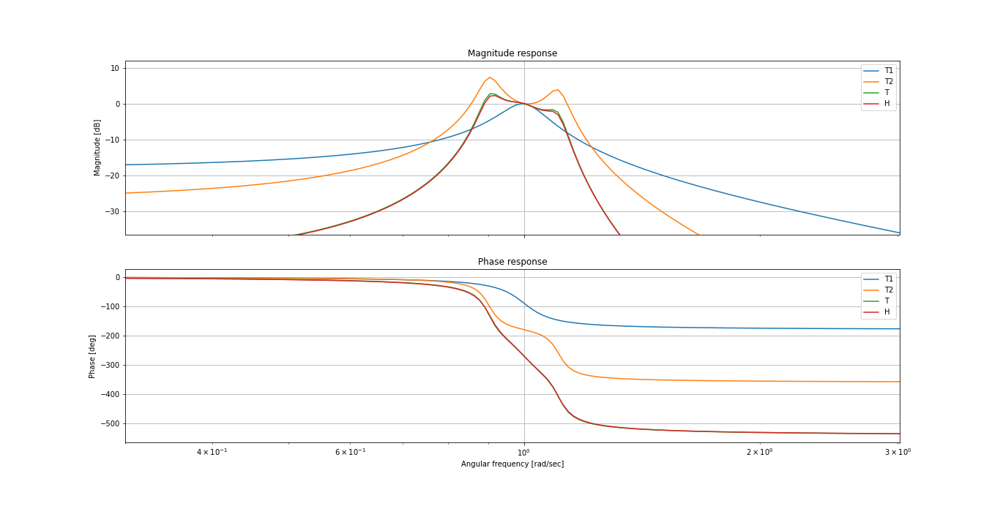

<<!-- Badged -->

<!-- PROJECT LOGO -->
 

  

  <h3 align="center">Circuit Theory II Folder</h3>

  

    Filter Design.
     
    <a href="https://github.com/lucasliano/TC2/blob/master/Trabajo_Semanal_3/Informe.ipynb"><strong>Explore »</strong></a>
     
     
    <a href="https://github.com/lucasliano/TC2/blob/master/Trabajo_Semanal_1/Informe.ipynb">View Demo</a>
    ·
    <a href="https://github.com/lucasliano/TC2/issues">Report Bug</a>
    ·
    <a href="https://github.com/lucasliano/TC2/issues">Request Feature</a>
  

<!-- ABOUT THE PROJECT -->
## About The Project

**MUST SEE**

- [Trabajo Semanal 1](https://github.com/lucasliano/TC2/blob/master/Trabajo_Semanal_1/Informe.ipynb)
- [Trabajo Semanal 2](https://github.com/lucasliano/TC2/blob/master/Trabajo_Semanal_2/Informe.ipynb)
- [Trabajo Semanal 3](https://github.com/lucasliano/TC2/blob/master/Trabajo_Semanal_3/Informe.ipynb)

### Images

<!-- CONTRIBUTING -->
## Contributing

Contributions are what make the open source community such an amazing place to be learn, inspire, and create. Any contributions you make are **greatly appreciated**.

1. Fork the Project
2. Create your Feature Branch (`git checkout -b feature/AmazingFeature`)
3. Commit your Changes (`git commit -m 'Add some AmazingFeature'`)
4. Push to the Branch (`git push origin feature/AmazingFeature`)
5. Open a Pull Request

<!-- LICENSE -->
## License

Distributed under the MIT License. See `LICENSE` for more information.

<!-- CONTACT -->
## Contact

Lucas Liaño - lliano@frba.utn.edu.ar

Project Link: [https://github.com/lucasliano/TC2](https://github.com/lucasliano/TC2)
